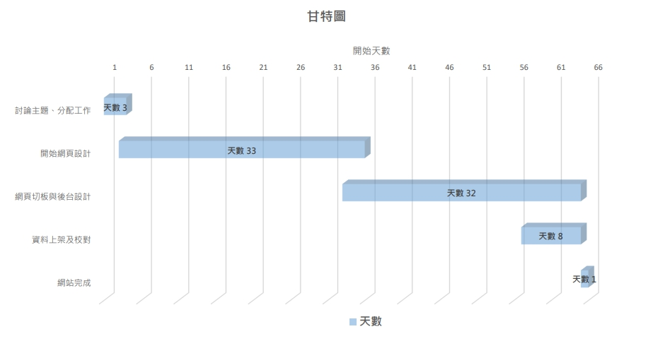
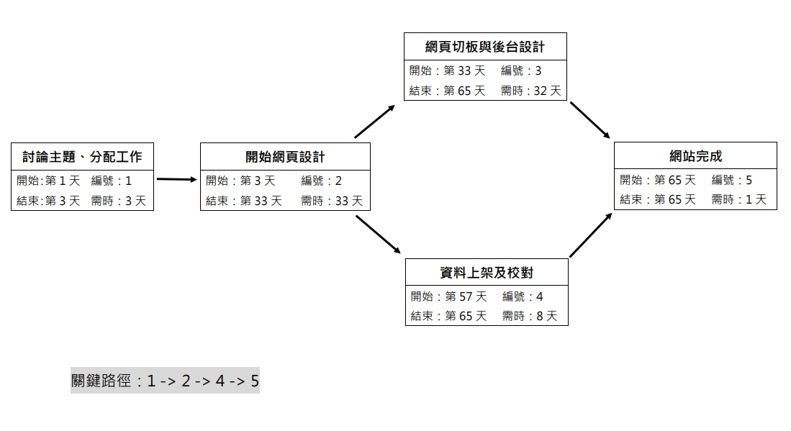

# 2020_test

# 呂品宜
## 呂品宜
### 呂品宜
#### 呂品宜
##### 呂品宜
###### 呂品宜

:smile:
:+1:

:-1:

|left | Center | Right |
|:----|:------:|-------:|
|1st  | 1st    | 1st   |
|2nd testing | 2nd testing | 2nd testing |

[NKUST](https://www.nkust.edu.tw/)
<https://www.nkust.edu.tw/>

***
##專案組長:呂品宜
##組員:李翊歆、郭惠敏
#個別的任務:
##網頁設計:呂品宜、李翊歆
##後台設計:郭惠敏、李翊歆
##資料上架及校對:呂品宜、李翊歆、郭惠敏
#專題題目:高雄、台南美食網
#內容:
##介紹高雄及台南的美食

***

